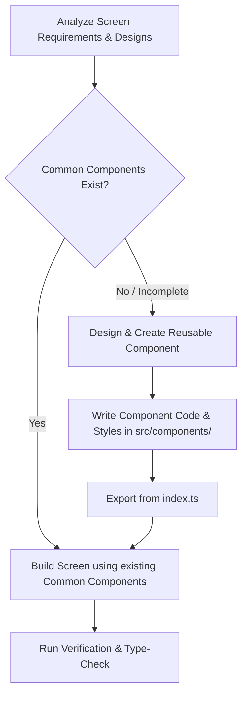

# Component-First Development Policy

This policy is mandatory for all developers, AI agents, and Model Context Protocol (MCP) clients working on the Talentra codebase.

## Policy Overview

> [!IMPORTANT]
> **DO NOT** write inline or ad-hoc custom UI elements directly on screens if they represent reusable layout blocks (such as input fields, buttons, cards, list items, or navigation bars).
> **BEFORE** implementing, modifying, or redesigning any application screen or page, you MUST identify and build all reusable common components first.

## Execution Workflow

When tasked with building or updating any user interface (UI) or screen:

### Step 1: Identify Reusable Blocks
Analyze the screen design mockup or wireframe. Deconstruct the page into structural components:
- Form fields (Inputs, Category Selectors, Role Toggle, Salary Pickers)
- Action buttons (Standard, Social, Google, Bookmark Icon Button, Apply Button)
- Layout wrappers (Cards, Card lists, Hero banners, Header tiles)
- Dynamic widgets (Pills, Filter chips, Slide dot-indicators for S1)
- Navigation (Tab bars, Back button)

### Step 2: Build/Refactor Common Components First
- Check the `src/components/` directory to see if a similar component already exists.
- If it does, refactor it if necessary to support new props, styling overrides, or variants (e.g., adding left-icon support or light/dark mode overrides).
- If it does not, create it following the **Component-per-Folder** pattern:
  - Component code: `src/components/MyComponent/MyComponent.tsx`
  - Component stylesheet: `src/components/MyComponent/MyComponent.styles.ts`
  - Shorthand export: `src/components/MyComponent/index.ts` (using `export { default } from './MyComponent';`)

### Step 3: Build the Screen
- Implement the screen layout inside `src/screens/`.
- Import and assemble the common components to compose the UI.
- Pass custom style overrides, sizes, and callbacks to the common components instead of writing ad-hoc local visual wrappers.
- Maintain the strict file organization specified in `CODE_GUIDELINES.md`.
